# HTPT/2: +Performance
<font size="3">versão 1.1</font>


- [HTPT/2: +Performance](#htpt2-performance)
  - [Apresentação Pessoal](#apresentação-pessoal)
  - [Histórico](#histórico)
  - [Onde está no HTTP no modelo OSI?](#onde-está-no-http-no-modelo-osi)
  - [+Dados sobre o uso do HTTP](#dados-sobre-o-uso-do-http)
  - [Suporte dos Web browsers ao HTTP/2](#suporte-dos-web-browsers-ao-http2)
  - [Anatomia do HTTP/1.1](#anatomia-do-http11)
  - [Forma de transmissão de dados](#forma-de-transmissão-de-dados)
  - [Frames](#frames)
  - [Comparações de desempenho](#comparações-de-desempenho)
  - [O que o HTTP/2 não resolve](#o-que-o-http2-não-resolve)
  - [Recursos para Identificação de suporte ao HTTP/2](#recursos-para-identificação-de-suporte-ao-http2)
  - [Implementações](#implementações)
  - [Conformidade](#conformidade)

---

## Apresentação Pessoal

<font size="2">Sou o Eduardo Vieira, Analista Programador. Considero-me +1 curioso da Computação desde 2004. Trabalhei no desenvolvimento de vários sistemas desde orgão distrital, federal e para instituição privada com linguagens como Java, Groovy, PHP, Javascript, PL/SQL, Shell Script, AWK <i>et al</i>, além de banco de dados como MySQL, Oracle <i>et al</i>. Ex-docente do IFB. Atualmente trabalho na TI do sistema bancário entre os projetos: o PIX. Já precisei escovar muitos bits para resolver problemas de performance ou de baixo nível.</font>

Telegram, Twitter <i>et al</i>: <b>@eduardoenemark</b>.
E-mail: <b>eduardoenemark@gmail.com</b>

---

## Histórico

> ***”HTTP (HyperText Transfer Protocol) is the underlying protocol of the World Wide Web. Developed by Tim Berners-Lee and his team between 1989-1991…”***
> Developer Mozilla<sup><a href="#1">1</a></sup>

==Internet != World Wide Web==.
    |->  Internet é TCP/IP, enquanto que Web é a sua parte visível, de fácil acesso.<sup><a href="#2">2</a></sup>

- **HTTP/0.9 (*~Ago/1991*): Simples em forma:** sem headers, status ou error codes, URL basicamente referenciado o caminho do documento HTML. Apenas GET:

> GET /mydoc.html

*Response:*

```html
<html>
  A very simple HTML page
</html>
```

- **HTTP/1.0 ([RFC 1945](https://www.rfc-editor.org/rfc/rfc1945.html): *~Mai/1996*)<sup><a href="#1">1</a></sup>:** Redesenhado com methods, headers, status code, version information no line e suporte a outros tipos de arquivos, body com suporte a binary. Praticamente próximo dos dias de hoje:

```html
GET /mypage.html HTTP/1.0
User-Agent: NCSA_Mosaic/2.0 (Windows 3.1)

200 OK
Date: Tue, 15 Nov 1994 08:12:31 GMT
Server: CERN/3.0 libwww/2.17
Content-Type: text/html
<HTML>
A page with an image
  
</HTML>
```

*Response:*

```html
GET /myimage.gif HTTP/1.0
User-Agent: NCSA_Mosaic/2.0 (Windows 3.1)

200 OK
Date: Tue, 15 Nov 1994 08:12:32 GMT
Server: CERN/3.0 libwww/2.17
Content-Type: text/gif
(image content)
```

- **HTTP/1.1 ([RFC 2068](https://www.rfc-editor.org/rfc/rfc2068.html): *~Jan/1997*):<sup><a href="#1">1</a></sup>** Melhorou o HTTP/1.0 com acréscimo como reutilização de conexão, persistência (keep-alives), pipelining (esquecido), chunked, cache control e novos headers como encoding, content accept, host e securities (CORS: Cross-Origin Resource Sharing e CSP: Content Security Policy).

> **Temos um HTTP na versão 1.1 muito bem funcional e conhecido na Web, além de padrões de desenvolvimento como SOA (...) e REST (*Representational State Transfer*) construídos sobre ele :smiley:, porém não tão performático :cry:.**

- **Tecnologias entre versões do HTTP:** SSL da Netscape em 1994 para um HTTP +seguro que depois virou o TLS, Server-sent events. Ajax, WebSocket *et al*.

- **HTTP/2.0 ([RFC 7540](https://www.rfc-editor.org/rfc/rfc7540.html): *Mai/2015*):<sup><a href="#1">1</a></sup>** É antecedido pelo protocolo experimental SPDY (pronuncia *"speedy"*) desenhado pelos engenheiros Mike Belshe e Robert Peon da Google em 2009. Tinha um desempenho 64% melhor no quesito *load time*. Executava sobre o HTTP.<sup><a href="#2">2</a></sup> O foco do SPDY era tratar as questões de performance existentes no HTTP/1.1. Surgem conceitos aplicados deste experimento de protocolo:
  - *Multiplexed streams*;
  - *Request priorization*; e
  - *Header compression*.

  No redesenho do HTTP na versão 2 passa a ser um protocolo +binário do que textual, +multiplexado do que síncrono e acréscimos:
  - *Flow Control*;
  - *Stream priorization*; e
  - *Server push*.

> SPDY implementou conceitos do TCP no HTTP utilizando multiplexação de mensagem.

## Onde está no HTTP no modelo OSI?

| 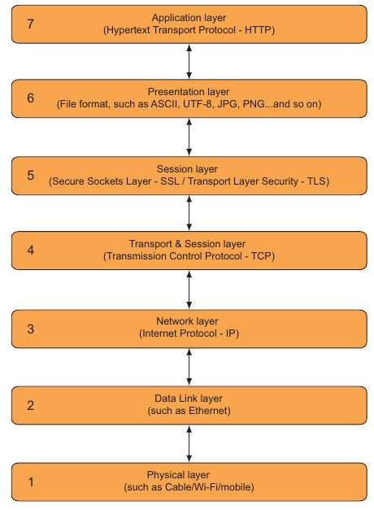 |
| :--: |
| *The transport layers of internet traffic*<sup><a href="#2">2</a></sup> |

## +Dados sobre o uso do HTTP

Tenha em mente que tais estatísticas citadas podem variar em comparação a outras conforme o conjunto de domínios observados ou parte da Web. Logo estas estatísticas e outras apenas dão uma noção imediata seja de uso ou demais métricas vinculadas ao protocolo.

| 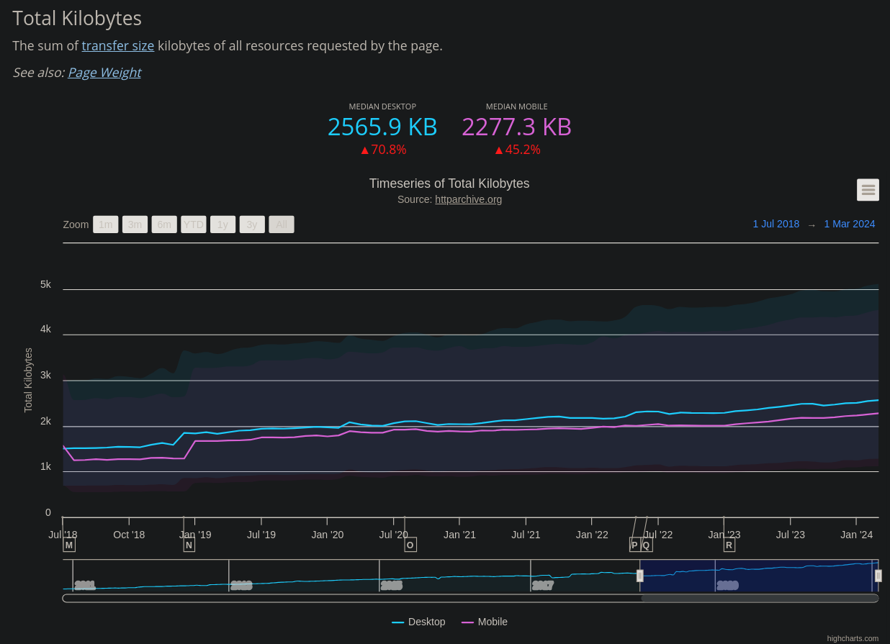 |
| :--: |
| *Total de Kilobytes por Página*<sup><a href="#3">3</a></sup> |

| 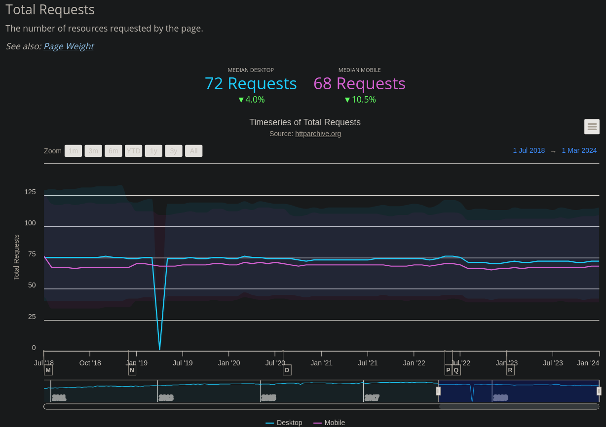 |
| :--: |
| *Resources por página*<sup><a href="#3">3</a></sup> |

| 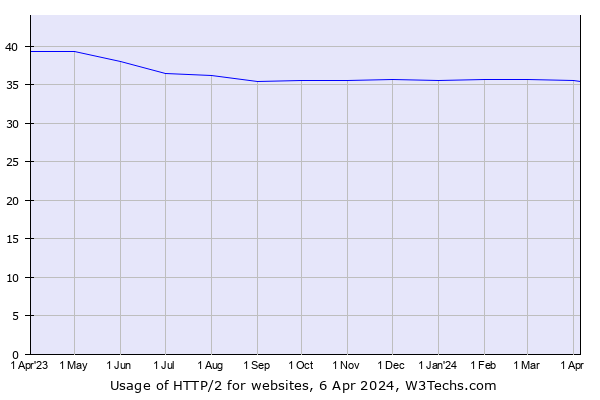 |
| :--: |
| *Recorte do Uso do HTTP/2*<sup><a href="#4">4</a></sup> |

## Suporte dos Web browsers ao HTTP/2

| 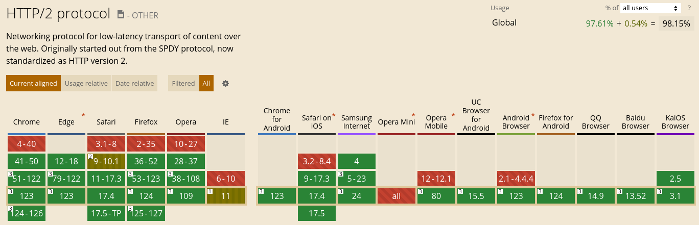 |
| :--: |
| *Suporte HTTP/2 nos web browsers*<sup><a href="#5">5</a></sup> |

| 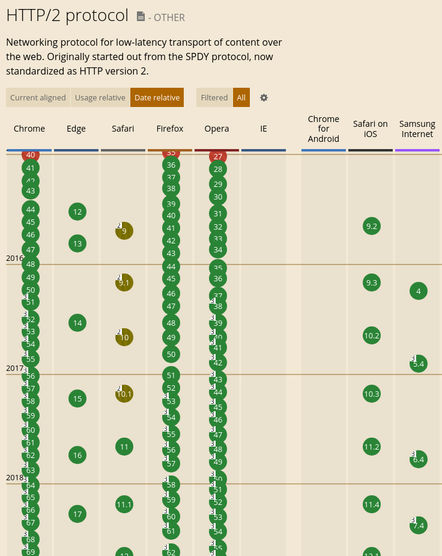 |
| :--: |
| *Timeline da versão com suporte ao HTTP/2*<sup><a href="#5">5</a></sup> |

## Anatomia do HTTP/1.1

O HTTP/1 é um protocolo textual composto de 3 partes: *Start line*, *headers* e *body* separadas por CRLF (*Carriage Return*, byte 13, + *Line Feed*, byte 10).<sup><a href="#6">6</a></sup> Os *headers* e *body* formam um *entity*, entidade. O que o torna um protocolo simples. No HTTP/2 tais partes continuam as mesmas.

- ***Start line***: Para o *request* significa *"o que fazer"*, enquanto que para o *response* *"o que aconteceu"*.
- ***Headers***: Consiste de campos de nome e valor separado por dois pontos.
- ***Body***: É o conteúdo da entidade/mensagem.

| 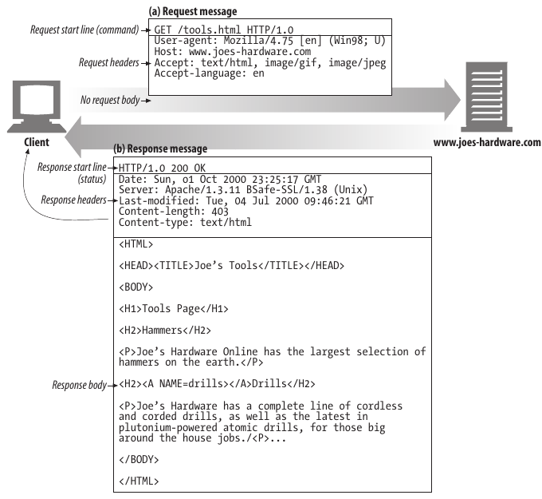 |
| :--: |
| *Anatomia do HTTP/1.1*<sup><a href="#6">6</a></sup> |

## Forma de transmissão de dados

A conexão no HTTP/1.1 é sincrona do tipo *request-and-response* (*blocking*), logo o ganho na performance está em multiplas conexões em paralelo e adoção de caches/CDN (*Content Delivery Network*).

| 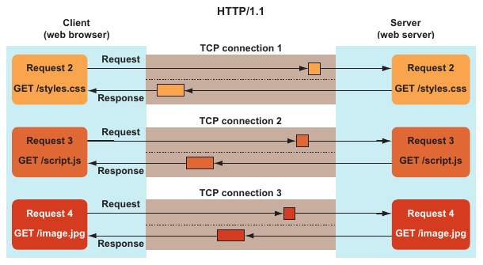 |
| :--: |
| *HTTP/1.1: Multiplas conexões em paralelo*<sup><a href="#2">2</a></sup> |

A [RFC 2616](https://www.rfc-editor.org/rfc/rfc2616.html), Jun/1999, orienta não mais do 2 conexões para qualquer servidor ou proxy para clientes que persistam a conexão. Esta premissa não se sustentou. Então na [RFC 7230](https://www.rfc-editor.org/rfc/rfc7230.html), Jun/2014, orienta que o cliente seja ponderante com o uso dos recursos no sentido de evitar congestionamentos, sobrecargas ou causar um *Denial of Service*.

Os atuais web browser tendem a limitar até 6 conexões simultâneas por domínio. Então se uma páginda da Web fizer referência a recursos que estão em outros domínio, logo serão acrescentadas novas conexões. No Firefox na propriedade *network.http.max-persistent-connections-per-server* possui valor 6 por padrão.

A transmissão de dados no HTTP/2 se dá por um conjunto de *streams* dentro de uma mesma conexão, multiplexação (*non blocking*). Cada *stream* é identificado e vinculado a uma determinado recurso, *file*. O *modus operandi* é binário ao contrário da forma textual do HTTP/1.1.

| 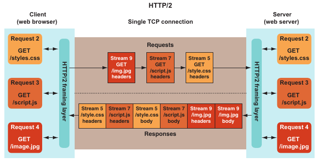 |
| :--: |
| *HTTP/2: Conexão multiplexada*<sup><a href="#2">2</a></sup> |

Os *frames* compõem os *streams* presentes no *Requests* e *Responses*. São similares ao *TCP packets*. Quando recebido todos os *frames* a mensagem HTTP pode ser reconstruída por completo.<sup><a href="#2">2</a></sup>

## Frames

O frame é composto de 6 partes sendo as primeiras 5 do *header*: *Length*, *Type*, *Flags*, *Reserved Bit* e *Stream Identifier*; E a última o *payload*, que são os dados em si da mensagem. Abaixo temos um recorte da tabela explicativa da página 121 do livro HTTP/2 in Action.<sup><a href="#2">2</a></sup> 

> Outros detalhamentos podem ser encontrados na secção 4.1 da ([RFC 7540](https://www.rfc-editor.org/rfc/rfc7540.html).

| 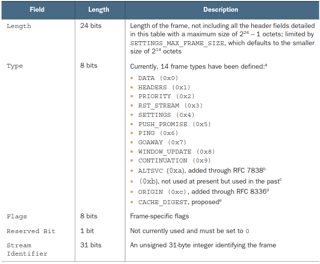 |
| :--: |
| *HTTP/2: Frame Header Format*<sup><a href="#2">2</a></sup> |

A visualização e análises facilitada dos frames de uma conexão HTTP/2 pode ser realizada com ferramentas como o *Wireshark* ou *nghttp*, por exemplo. Vamos utilizar o *nghttp*<sup><a href="#17">17</a></sup> para a visualiar os frames trocados ao acesso do domínio *[yandex.com](https://yandex.com)*:

```cli
nghttp -v https://yandex.com | less
```

Temos os prints abaixo onde os frames são melhores observavéis dentro da massa de dados retornada. O *h2* sinaliza uma conexão HTTPS/2, o client na abertura da conexão realiza o envio, *send*, dos frames: *SETTINGS*, *PRIORITY* e *HEADERS*. No servidor por vez retorna os frames de resposta, *recv*, que podem atualizar os valores enviados: *SETTINGS* e *WINDOW_UPDATE*.

| 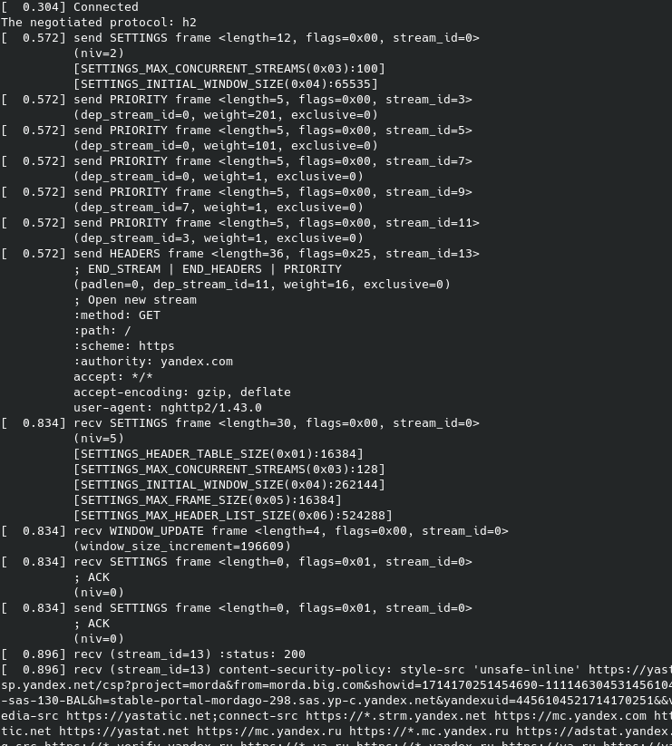 |
| :--: |
| Print do início da conexão HTTP/2 (*h2*) ao domínio *yandex.com* |

| 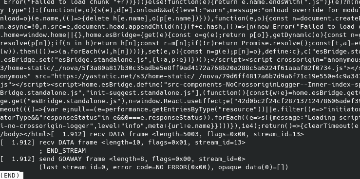 |
| :--: |
| Print do fim da conexão HTTP/2 (*h2*) ao domínio *yandex.com* |

Após o recebimento dos frames do tipo *DATA* temos o encerramento dos *streams* pelo cliente ao envio do frame *GOAWAY*.

## Comparações de desempenho

Para fins didáticos de comparação, inicialmente vamos utilizar o site Tune The Web<sup><a href="#7">7</a></sup> para verificar resultados entre o HTTP/1.1 e HTTP/2. O teste aplicado<sup><a href="#8">8</a></sup> é apenas solicitar a mesma imagem 360 vezes utilizando um contador presente na *query* da URL. Iniciamos pelo HTTP/1.1 de tempo total de 61.321*s*:

| 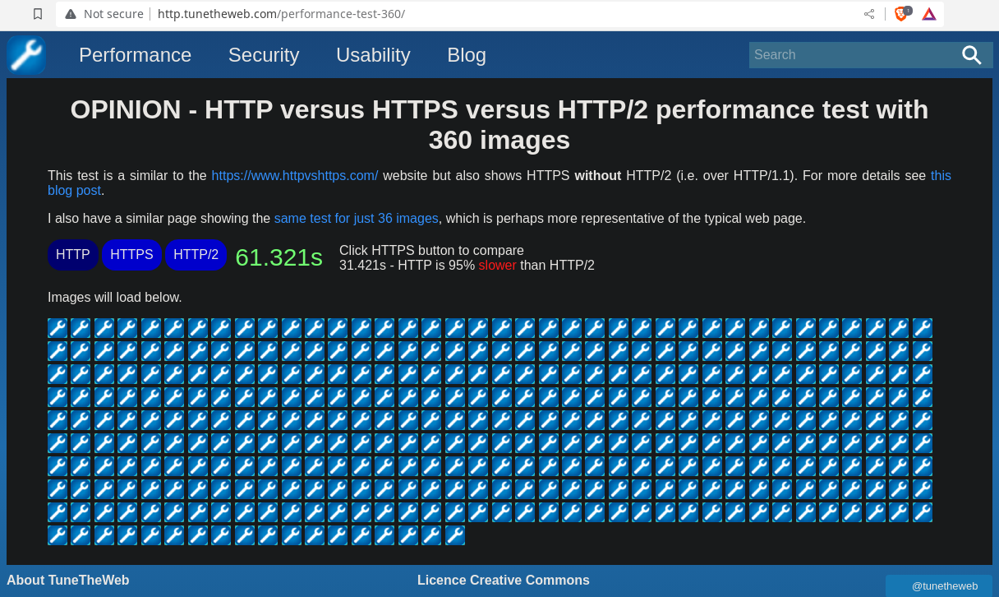 |
| :--: |
| *Tune The Web<sup><a href="#7">7</a></sup>: HTTP Performance Test*<sup><a href="#7">7</a></sup> |

Importante realizar a inspeção pelo *DevTools* para saber se realmente as requisições foram realizadas:

| 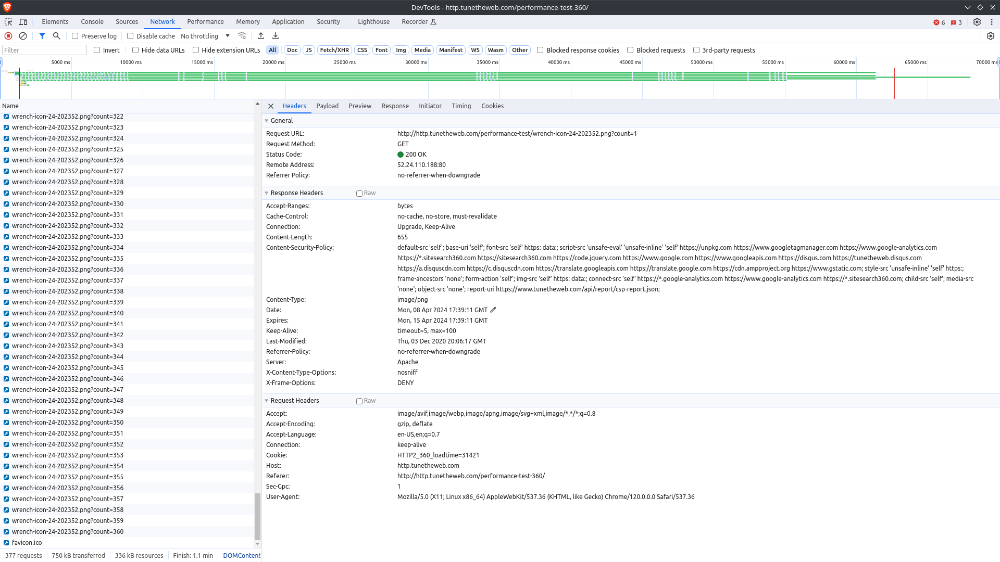 |
| :--: |
| *Inspeção pelo DevTools do HTTP Performance Test*<sup><a href="#7">7</a></sup> |

Executado o mesmo teste utilizando o HTTP/2 temos 1.714*s*:

| 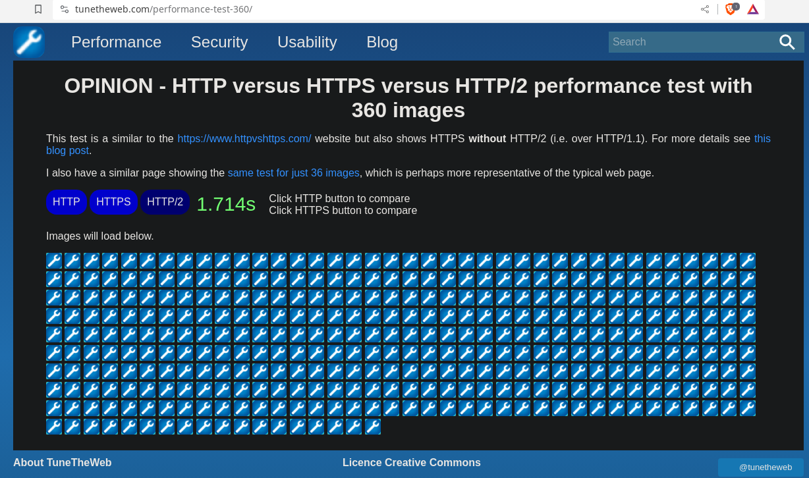 |
| :--: |
| *Tune The Web<sup><a href="#7">7</a></sup>: HTTP/2 Performance Test*<sup><a href="#7">7</a></sup> |

Novamente realizado a inspeção e verificamos a presença de apenas 1 conexão no HTTP/2, enquanto que no HTTP/1.1 há pelo menos 6 conexões simultâneas:

| 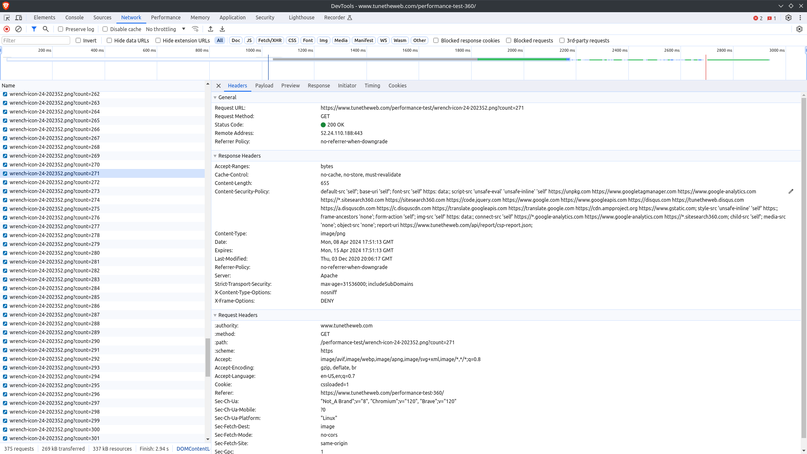 |
| :--: |
| *Tune The Web<sup><a href="#7">7</a></sup>: Inspeção pelo DevTools do HTTP Performance Test*<sup><a href="#7">7</a></sup> |

> No teste acima o HTTP/2 não teve ainda melhor performance devido a camanda TLS que é submetida a requisição e mensagem de resposta. Os *web browsers* utilizam preferencialmente comunicações HTTP/2 sobre TLS.

O site HTTP2 Demo<sup><a href="#9">9</a></sup>, também, faz um teste bem semelhantes ao visto do Tune The Web<sup><a href="#7">7</a></sup>. Quando a página é carregada ou utilizado o botão *Refresh* na mesma é disparado uma sequência de requisições do tipo HTTP/1.1 para compor a imagem maior de exemplo constituída de outras 170 images menores.

|  |
| :--: |
| *HTTP2 Demo<sup><a href="#9">9</a></sup>: Teste comparativo de performance entre HTTP/1.1 e 2* |

Nesta nova inspeção habilitamos para display as colunas: *Method*, *Protocol*, *Time* e *Connection ID*. Existem três pontos a ser notar nesta inspeção do DevTools, imagem abaixo:

- A coluna *Protocol* tem o valor *h2* que sinaliza que a requisição realizada é do tipo HTTP/2;
- A coluna *Connection ID* é o mesmo de número 477021; e
- *Waterfall* possui uma diferença mínima de tempo entre os streams quando visto pelo conjunto de *Queueing* (retângulo branco), *Stalled* (cinza), *Waiting* (verde) e *Content Download* (azul)<sup><a href="#10">10</a></sup>.

| 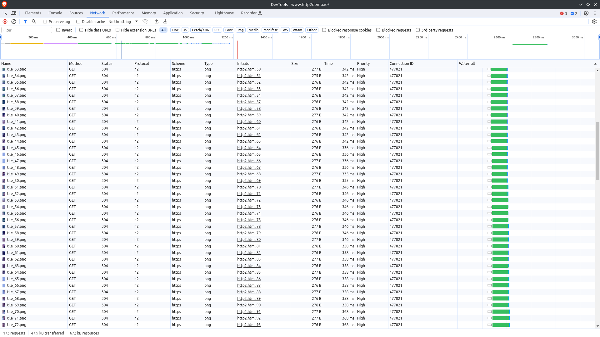 |
| :--: |
| *HTTP2 Demo<sup><a href="#9">9</a></sup>: Inspeção pelo DevTools do HTTP Performance Test*<sup><a href="#7">7</a></sup> |

## O que o HTTP/2 não resolve

- Páginas Web mal estruturadas, por exemplo: com imagens gigantes, muitos arquivos CSS e JS sem uso;
- Serviço de backend de processamento dos dados é lento para responder requisições da Web;
- Falta de estratégias de uso de cache;
- Não uso de compactação para a transmissão de dados quando suportado pelo cliente;
- Quantidade enorme de *headers* sem uso de estratégias de compactação ou desnecessários; e
- Requisição única para um único resource, *file*. A diferença de tempo não é significativa.

## Recursos para Identificação de suporte ao HTTP/2

- HTTP Dev: <https://http.dev/2/test>
- KeyCDN: <https://tools.keycdn.com/http2-test>
- HTTP2 Pro: <https://http2.pro>
- HTTP *Header Upgrade*, exemplo pela CLI (curl<sup><a href="#11">11</a></sup>) onde é realizado uma requisição HTTP/1.1, porém o servidor informa no *header response* que suporta o HTTP/2 (*Upgrade: h2,h2c*):

```cli
curl -kvo /dev/null --http1.1 -L https://debian.org
```

*Response:*

```cli
...
< HTTP/1.1 200 OK
< Date: Wed, 10 Apr 2024 03:05:06 GMT
< Server: Apache
< Content-Location: index.en.html
< Vary: negotiate,accept-language,Accept-Encoding,cookie
< TCN: choice
< X-Content-Type-Options: nosniff
< X-Frame-Options: sameorigin
< Referrer-Policy: no-referrer
< X-Xss-Protection: 1
< Permissions-Policy: interest-cohort=()
< Strict-Transport-Security: max-age=15552000
< Upgrade: h2,h2c
< Connection: Upgrade
...
```

> Poderíamos usar a opção *--http2* no curl em um outro domínio qualquer e haveria resposta como *HTTP/1.1 200 OK* no *header response* em caso de não suporte ao HTTP/2.

## Implementações

No Github do IETF HTTP Working Group<sup><a href="#12">12</a></sup> temos o repositório *http2-spec*<sup><a href="#13">13</a></sup> que trata das implementações do HTTP/2, além de outras *tools*<sup><a href="#14">14</a></sup> que poderão nos auxiliar em demais testes:

| 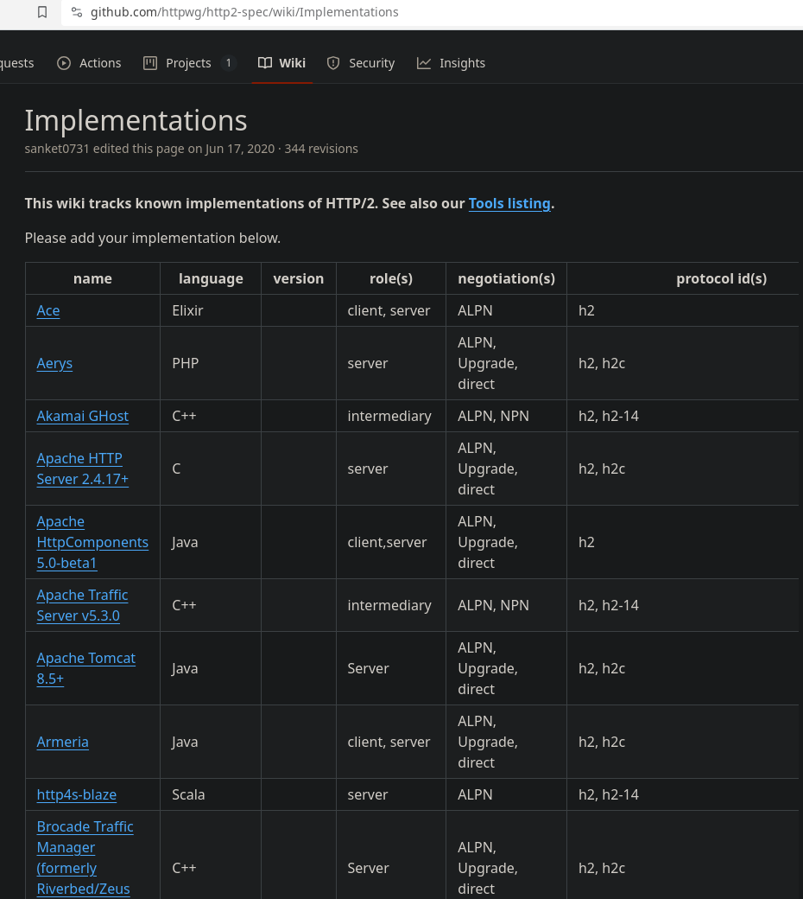 |
| :--: |
| *HTTP WG Implementations<sup><a href="#13">13</a></sup> |

## Conformidade

Independentemente da escolha da implementação escolhida sempre é necessário que possamos realizar verificações se está conforme descrito nas RFCs, além é claro de demais teste de integração e navegação.

E uma ferramenta, em especial, citada no repositório *http2-spec*<sup><a href="#13">13</a></sup> que possa nos ajudar a realizar estas verifcações é a *h2spec*<sup><a href="#15">15</a></sup>. Podemos realizar o *build* ou baixar uma versão pronta, *release*.

Na CLI executamos o comando:

```cli
./h2spec -t -k -S -h apache.org -p 443
```

Como visto no resultado abaixo a implementação HTTP/2 no *httpd*<sup><a href="#16">16</a></sup> no domínio raíz da Apache teve ótimo desempenho, apenas 1 um teste dos 147:

| 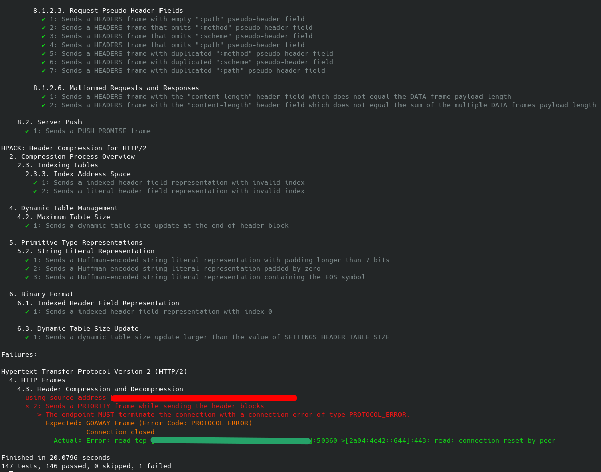 |
| :--: |
| H2spec Test<sup><a href="#15">15</a></sup> sobre o domínio apache.org |

<br />

[#Início do doc](#htpt2-performance)<br />

<font size="2">Este doc foi construído utilizando [Markdown](https://www.markdownguide.org/).</font>

**FliSol 2024. HTTP/2: +Performance. @eduardoenemark**.

---

<span id="1">1</span>. <https://developer.mozilla.org/en-US/docs/Web/HTTP/Basics_of_HTTP/Evolution_of_HTTP>
<span id="2">2</span>. HTTP/2 in Action, Barry Pollard. Manning Publications, 2019.
<span id="3">3</span>. <https://httparchive.org/reports/state-of-the-web>
<span id="4">4</span>. <https://w3techs.com/technologies/details/ce-http2>
<span id="5">5</span>. <https://caniuse.com/?search=http2>
<span id="6">6</span>. HTTP: The Definitive Guide, David Gourley & Brian Totty. O'Reilly, 2002.
<span id="7">7</span>. <https://www.tunetheweb.com/performance-test-360>
<span id="8">8</span>. Testes realizados entre 08/04 a 09/04/2024.
<span id="9">9</span>. <https://http2demo.io>
<span id="10">10</span>. <https://developer.chrome.com/docs/devtools/network/reference/?utm_source=devtools#timing-explanation>
<span id="11">11</span>. <https://curl.se/docs/manpage.html>
<span id="12">12</span>. <https://github.com/httpwg>
<span id="13">13</span>. <https://github.com/httpwg/http2-spec/wiki/Implementations>
<span id="14">14</span>. <https://github.com/httpwg/http2-spec/wiki/Tools>
<span id="15">15</span>. <https://github.com/summerwind/h2spec>
<span id="16">16</span>. <https://httpd.apache.org>
<span id="17">17</span>. <https://nghttp2.org>
<span id="18">18</span>. https://httpwg.org/specs/rfc7540.html
